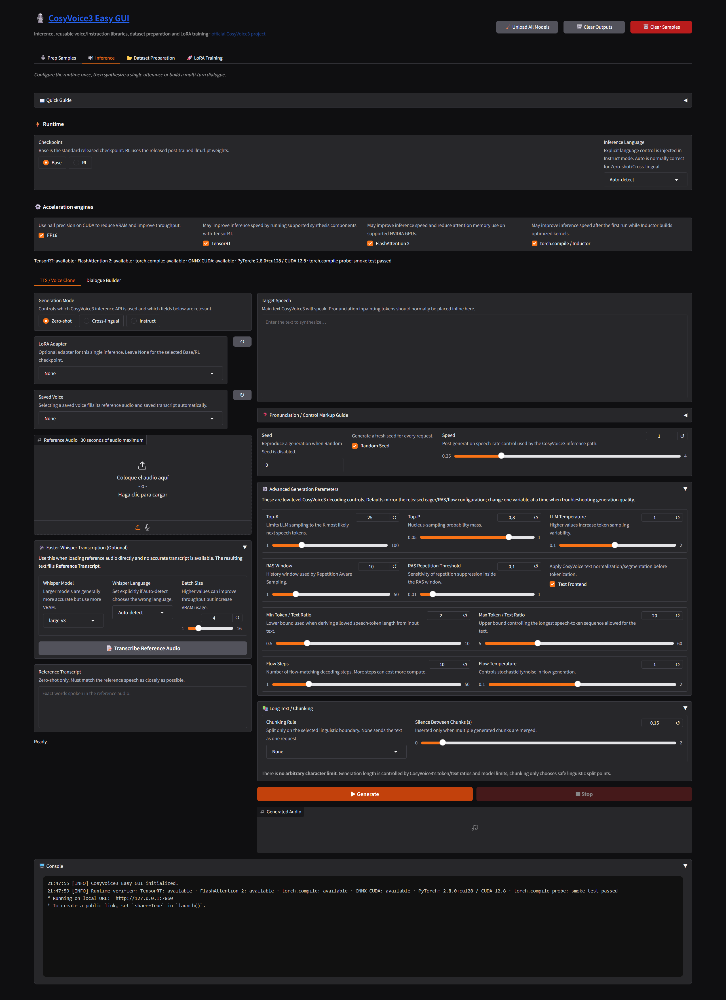
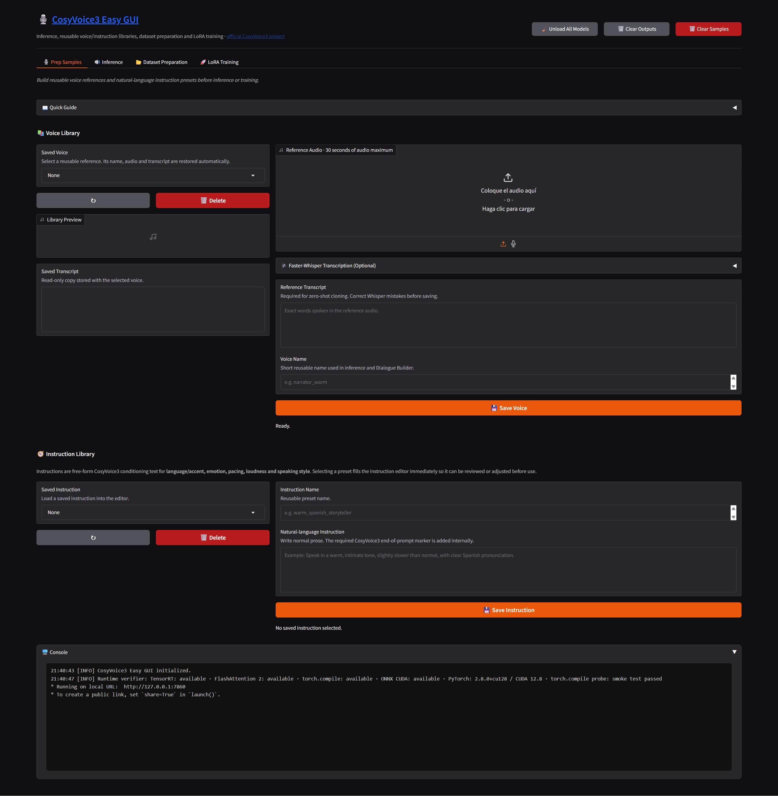
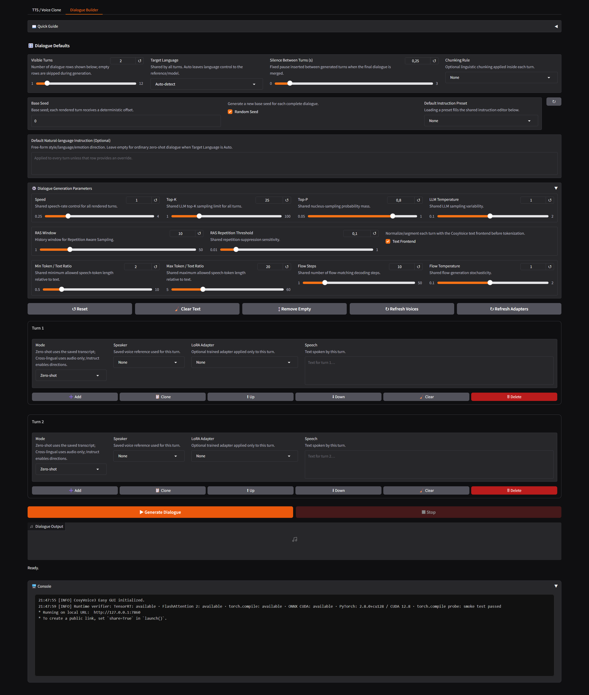
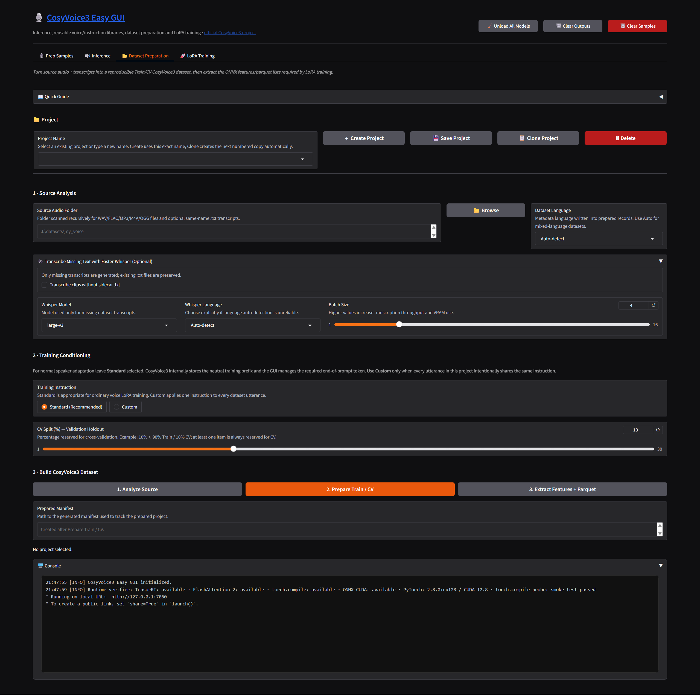
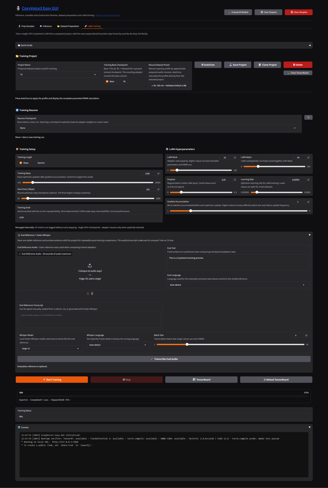

# 🎙️ CosyVoice3 Easy GUI: Inference + LoRA Training

A project-local Windows Easy GUI for **Fun-CosyVoice3-0.5B-2512**

**Upstream:** [FunAudioLLM/CosyVoice](https://github.com/FunAudioLLM/CosyVoice) · **Model:** [Fun-CosyVoice3-0.5B-2512](https://huggingface.co/FunAudioLLM/Fun-CosyVoice3-0.5B-2512)

> This repository is an Easy GUI and Windows training/inference wrapper around the upstream project. Refer to upstream for model cards, licenses and research details.

## 🧭 Quick Start

| Step | Action |
| :---: | :--- |
| 1 | Run `1- install.bat` once from a writable project folder. |
| 2 | Run `2- run.bat` and open the local Gradio URL. |
| 3 | Use **Prep Samples** for reusable voices/instructions, or go directly to **TTS / Voice Clone**. |
| 4 | For LoRA, create a project, prepare Train/CV data, extract features/parquet, then start training. |

The default model is downloaded on demand; startup does not download large model files.

## ✨ Main Features

- **Voice Library / Prep Samples** with reusable reference audio and transcripts.
- **Instruction Library** for reusable free-form CosyVoice3 language/accent/emotion/speed/volume/style directions.
- **Optional Faster-Whisper CUDA transcription** for reference samples and missing dataset transcripts.
- **Zero-shot voice cloning** from reference audio + transcript.
- **Cross-lingual synthesis** from reference audio.
- **Instruct synthesis** with natural-language control over language, dialect, emotion, speed and style.
- **9 primary languages** exposed explicitly: Chinese, English, Japanese, Korean, German, Spanish, French, Italian and Russian.
- **Dialogue Builder** with modular turn rows: add, clone, move, clear and delete.
- **Long Text / Chunking** with `None`, Paragraph/Sentence Auto, Periods, Paragraphs, Lines and Speaker Turns; no arbitrary character ceiling.
- **Random Seed** controls for single inference and Dialogue Builder.
- **Base / RL checkpoint selection**.
- **Optional LoRA adapters** shared by single inference and Dialogue Builder.
- **Dataset Preparation** with persistent projects, train/CV split and official CosyVoice feature/parquet extraction.
- **PEFT LoRA Training** for the CosyVoice3 Qwen LLM attention projections.
- **Evidence-based LoRA AutoTune profiles** with an on-screen VRAM calculation, simple checkpoints and CV metrics.
- **Live training progress** with epoch progress, elapsed time, ETA and latest detected CV loss.
- **TensorBoard** launch/reload controls.
- **Shared embedded console** at the bottom of the application.
- **Completion chime** after transcription, inference, dataset preparation/feature extraction and completed training runs.
- **On-demand model download**: the GUI downloads or repairs the default CosyVoice3 model only when it is first needed.

## 🖥️ Requirements

- Windows 10 or Windows 11 x64.
- NVIDIA GPU with a working NVIDIA driver.
- 32 GB system RAM recommended.
- 12 GB VRAM minimum recommended for inference; more VRAM is strongly preferred for LoRA training.
- Internet access for the initial environment installation and first model download.

## 📦 Installation

1. Extract the complete project to a normal writable folder.
2. Run:

   `1- install.bat`

3. The installer creates a project-local Python **3.11.15** runtime and validates the canonical `uv.lock`. If the lock is stale or belongs to an older dependency contract, the development installer deletes it and resolves a **fresh Windows x64-only lock from `pyproject.toml`**, validates that new lock, and then installs the complete CUDA 12.8 core with `uv sync --frozen`.
4. When installation completes, run:

   `2- run.bat`

The launcher strictly verifies PyTorch CUDA, cuDNN, Faster-Whisper CUDA, ONNX CUDA EP, FlashAttention 2, Triton/`torch.compile` and TensorRT before opening the GUI. It does **not** force a model download during startup.

### Frozen Windows CUDA Matrix

The final Windows runtime is fixed to:

| Component | Frozen version |
| --- | --- |
| Python | `3.11.15` |
| PyTorch | `2.8.0+cu128` |
| Torchaudio | `2.8.0+cu128` |
| CUDA runtime | `12.8` |
| cuDNN | major `9` from the PyTorch wheel |
| ONNX Runtime GPU | `1.26.0` |
| ONNX | `1.16.0` |
| CTranslate2 | `4.8.1` |
| Faster-Whisper | `1.2.1` |
| triton-windows | `3.4.0.post21` |
| FlashAttention | `2.8.3` (`cu128` / Torch 2.8 / CPython 3.11 Windows wheel) |
| TensorRT CUDA 12 | `10.13.3.9` |

The machine-readable copy is `config/runtime_windows_cuda128.json`; the human-readable runtime reference is `requirements-windows-cu128.txt`.

## 📥 Model Download Behavior

The default model is:

`FunAudioLLM/Fun-CosyVoice3-0.5B-2512`

Model files are stored under:

`models/Fun-CosyVoice3-0.5B-2512/`

If the model is missing or incomplete, the runtime downloads/repairs it automatically when inference, feature extraction or training first needs it. This matches the on-demand workflow used by the current sibling Easy GUIs.

The default model is downloaded from Hugging Face with `huggingface_hub`. The pinned `hf-xet` package is used automatically and keeps its project-local cache under `.runtime/cache/huggingface/xet`. WeText may separately download its small text-normalization FST resources from ModelScope into `.runtime/cache/modelscope`; this is expected and is not a fallback download of the CosyVoice3 model.

`tools/ensure_model.py` remains available as an optional manual command-line repair/check tool, but it is no longer part of normal GUI startup.

## 🎙️ Prep Samples

Prep Samples now contains two reusable libraries.

### Voice Library

1. Select or record **Reference Audio**.
2. Optionally open **Faster-Whisper Transcription (Optional)**.
3. Transcribe and manually correct the text.
4. Enter a **Voice Name**. The Whisper language selector above controls transcription language; there is no second redundant reference-language field.
5. Save with **💾 Save Voice**. Selecting a saved voice later restores both its audio and transcript automatically.

Saved voices appear immediately in both **TTS / Voice Clone** and **Dialogue Builder**. `None` is the explicit no-library-selection value and Refresh preserves a valid current selection.

### Instruction Library

CosyVoice3 natural-language instructions are ordinary text directions. They can describe language/accent, emotion, pace, volume or speaking style, for example:

- `Speak softly and warmly, slightly slower than normal.`
- `Use energetic Argentine Spanish with clear articulation.`
- `Sound calm, intimate and reassuring.`

The GUI stores the human-readable instruction only. The internal `<|endofprompt|>` delimiter required by CosyVoice3 is appended automatically when the instruction is used. Selecting a saved instruction immediately fills the editable natural-language instruction textbox. Saved instructions are reusable from **Instruct** and **Dialogue Builder**. Dataset training deliberately keeps only Standard or Custom conditioning.

## 🔊 Inference

### Shared Runtime Controls

The runtime controls sit above both inference workflows and therefore apply consistently to single inference and Dialogue Builder:

- **Model Variant:** `Base` or `RL`.
- **Inference Language:** `Auto-detect` or an explicit supported language. The explicit selector becomes a direct natural-language control in **Instruct** mode; Zero-shot/Cross-lingual preserve their native text/reference behavior.
- **FP16**.
- **TensorRT** when the installed runtime actually provides it.
- **FlashAttention 2** when a compatible package is actually installed.
- **torch.compile / Inductor** one boolean control; the Windows-safe `default` mode is managed internally.

LoRA is deliberately not global: TTS / Voice Clone has its own selector, and each Dialogue Builder turn has an independent selector.

There are intentionally no manual **Download Model** or **Load Model** buttons. Loading is automatic when generation begins.

### Accelerator Availability

The Windows runtime now installs every supported acceleration path as part of one frozen matrix. The GUI still probes them at startup so an import/driver failure cannot be mistaken for an available accelerator.

- **FP16:** normal CUDA inference path.
- **TensorRT:** frozen `tensorrt-cu12 10.13.3.9`; used by CosyVoice's flow-decoder TensorRT path.
- **FlashAttention 2:** frozen Windows wheel `2.8.3` built for PyTorch 2.8 + CUDA 12.8 + CPython 3.11. The backend order is deterministic: FlashAttention 2, then SDPA, then eager only if SDPA also fails.
- **torch.compile / Inductor:** enabled through `triton-windows 3.4.0.post21`, paired with PyTorch 2.8. CUDA Graphs and `max-autotune` are disabled for CosyVoice's variable-length Windows path; the GUI exposes only the boolean control.
- **ONNX CUDA EP:** `campplus.onnx`, `speech_tokenizer_v3.onnx` and ONNX validation/export sessions prefer `CUDAExecutionProvider`, with CPU only as an explicit fallback inside the engine. The conflicting CPU `onnxruntime` distribution pulled transitively by Faster-Whisper is excluded/removed so only the GPU distribution owns the `onnxruntime` module.
- **Faster-Whisper CUDA:** CTranslate2 is upgraded to `4.8.1` so the ASR path shares the CUDA 12/cuDNN 9 generation instead of the former CTranslate2 4.4/cuDNN 8 workaround.

The installer ends with real smoke checks, including a CUDA ONNX inference and a `torch.compile` CUDA kernel. If a required fixed accelerator fails, installation stops instead of silently calling the environment complete.

### Direct Reference Transcription

The TTS / Voice Clone workflow includes a collapsed **Faster-Whisper Transcription (Optional)** accordion. This is useful when reference audio is loaded directly in Inference instead of first being saved through Prep Samples. Choose the Whisper model/language only when needed, transcribe, correct the text, and the result fills **Reference Transcript**. If the backend-visible audio path has an accessible same-basename `.txt`, the GUI can reuse that text automatically; browser uploads may be copied to a temporary path, so Faster-Whisper remains the reliable fallback.

## 🗣️ CosyVoice3 Modes

### Zero-shot

Use reference audio plus an accurate reference transcript to clone the speaker.

### Cross-lingual

Use the reference voice without requiring the reference transcript. This is the correct mode when the desired target speech differs linguistically from the reference and you do not need natural-language instruction control.
The GUI automatically prepends CosyVoice3's required internal `<|endofprompt|>` conditioning block; users should enter only the text they want spoken.

### Instruct

Uses CosyVoice3 `inference_instruct2` and exposes natural-language control. When an explicit **Inference Language** is selected in the shared Runtime strip, the GUI injects that request into the instruction before `<|endofprompt|>`.

The primary language selector contains:

- Auto-detect
- Chinese
- English
- Japanese
- Korean
- German
- Spanish
- French
- Italian
- Russian

**Important:** auto-detection can produce an unintended accent. For explicit language control, select the language and use **Instruct** mode.

The language selector is not misrepresented as a direct API argument for Zero-shot or Cross-lingual mode; those upstream entry points do not expose a dedicated language parameter.

## ⚙️ Generation Parameters

The normal workflow keeps only the high-level controls visible: mode, voice/reference, instruction when relevant, seed/random seed and speed. Lower-level decoding controls live under **Advanced Generation Parameters**:

- **Text Frontend**
- **Top-K** (`25` default)
- **Top-P** (`0.8` default)
- **LLM Temperature** (`1.0` default)
- **RAS Window** (`10` default)
- **RAS Repetition Threshold** (`0.1` default)
- **Min Token / Text Ratio** (`2.0` default)
- **Max Token / Text Ratio** (`20.0` default)
- **Flow Steps** (`10` default)
- **Flow Temperature** (`1.0` default)

These values are passed through the CosyVoice3 LLM/RAS/flow path rather than being decorative UI controls. Dialogue Builder exposes the same generation set in its own advanced accordion.

`torch.compile` has no user-facing mode selector. When enabled, the runtime uses the safe internal default and reports the effective backend in the console (`ACTIVE`, `FALLBACK` or `DISABLED`).

## 🔤 Pronunciation / Control Markup

CosyVoice3 does **not** support arbitrary user-invented bracket tags. Its tokenizer registers a finite control/pronunciation vocabulary. The upstream README explicitly describes pronunciation inpainting for **Chinese Pinyin** and **English CMU phonemes**, while the tokenizer contains the exact special-token inventory.

User-facing vocal/style controls include: `[breath]`, `[quick_breath]`, `[noise]`, `[laughter]`, `<laughter>...</laughter>`, `[cough]`, `[clucking]`, `[accent]`, `[hissing]`, `[sigh]`, `[vocalized-noise]`, `[lipsmack]`, `[mn]`, and `<strong>...</strong>`. Unknown tags are not a supported extension mechanism.

English pronunciation inpainting uses the finite CMU/ARPAbet inventory (for example `[B]`, `[SH]`, `[ZH]`, `[AH0]`, `[IY1]`, `[AA1]`). Chinese pronunciation inpainting uses the finite bracketed Pinyin inventory registered by `CosyVoice3Tokenizer`, including initials/finals and tone-marked finals such as `[j][ǐ]`, `[zh]`, `[ang]`, `[iǎo]` and `[uǒ]`.

Place pronunciation and control tokens directly **inline in Target Speech** at the word or event location where they belong. There is no separate append field. System delimiters such as `<|endofprompt|>` are managed internally and should not be typed into normal speech text.

## 📚 Long Text / Chunking

Default is **None**. The complete family-aligned rule set is:

- `None`
- `Paragraph/Sentence Auto`
- `Periods`
- `Paragraphs`
- `Lines`
- `Speaker turns`

There is deliberately **no Max Characters per Chunk control**. Chunk boundaries are linguistic/structural only. With `None`, the complete text is sent as one request; model generation length remains governed by CosyVoice3's token/text ratios and model limits. **Silence Between Chunks** controls only the merge gap.

Streaming mode is not exposed in this GUI. The Easy GUI produces complete WAV outputs and avoids presenting an upstream iterator as progressive Gradio audio streaming.

### Start / Stop State

Long-running actions use mutually exclusive controls. While single inference or Dialogue Builder generation is active, **Generate** is disabled and **Stop** is enabled; when the operation finishes or is stopped, the states reverse. **Start Training / Stop Training** follows the same contract, with the training poller restoring the idle state after the process exits.

## 💬 Dialogue Builder

Dialogue Builder follows the IndexTTS/FireRed modular-row workflow while removing duplicated per-turn defaults.

**Dialogue Defaults** contains:

- Target Language
- Silence Between Turns
- Chunking Rule
- Base Seed / Random Seed
- Default Instruction Preset / free-form instruction
- Advanced generation parameters

Each turn contains only:

- Mode: Zero-shot, Cross-lingual or Instruct
- Speaker
- Optional LoRA Adapter for that turn
- Speech
- Dynamic Instruction Override, visible only for Instruct

Language is no longer repeated on every row, and pause-after-turn is no longer a per-row numeric field. Each row selects its mode explicitly. Zero-shot restores the saved voice transcript, Cross-lingual uses the saved reference audio without its transcript, and Instruct inherits the shared defaults unless it provides an instruction override.
The Single Inference LoRA selector lives inside **TTS / Voice Clone**. Dialogue Builder has an independent adapter selector on every turn, so changing an adapter for one speaker does not silently affect the remaining turns.

Rows retain the family actions **Add, Clone, Up, Down, Clear and Delete**, plus global Reset/Clear/Remove Empty/Refresh Voices controls.

## 📂 Dataset Preparation

The visible workflow is intentionally linear:

1. **Analyze Source** — discover supported audio, read same-name `.txt` transcripts and optionally transcribe missing text with Faster-Whisper.
2. **Prepare Train / CV** — validate analyzed pairs, normalize audio, split Train/CV and write the CosyVoice3 mappings/manifest.
3. **Extract Features + Parquet** — run the official embedding, speech-token and parquet preparation pipeline.

The former **Discovered Dataset** table has been removed. Analysis state is kept internally because the editable table duplicated source transcript management and made the workflow visually noisy.

### Training Instruction

CosyVoice3 training carries an `instruct` prefix per utterance. The GUI presents that requirement as only two choices:

- **Standard (Recommended)** — neutral `You are a helpful assistant.` conditioning, appropriate for ordinary voice adaptation.
- **Custom** — enter one consistent natural-language instruction only when the whole dataset intentionally represents that instructed behavior.

The GUI appends `<|endofprompt|>` internally. Users do not need to know or type the delimiter.

The **CV Split (%) — Validation Holdout** slider means the percentage reserved for validation, not training. For example, `10%` produces approximately 90% Train / 10% CV while guaranteeing at least one CV item when the dataset size permits.

Project metadata lives under `training/projects/<project>/`; prepared data lives under `training/datasets/<project>/`. **Create Project** creates exactly the entered Project Name; **Save Project** only updates an existing project; **Clone Project** is the only action that creates an incremental sibling such as `voice-02`, `voice-03`, and so on.

Both project selectors intentionally start empty. Selecting a project after startup triggers the complete Dataset Preparation and LoRA Training state restoration; the GUI does not preselect a name without firing its load event.

Project persistence is complete across both Dataset Preparation and LoRA Training. Selecting the project from **either tab** restores both surfaces: source/prepared dataset path, dataset language, missing-transcript toggle, Whisper settings, instruction mode, CV split, manifest, analyzed rows, Base/RL, AutoTune profile, Steps/Epochs mode and targets, Seed, Rank, Alpha, Dropout, Learning Rate and evaluation settings.

## 🚀 LoRA Training

The training tab uses the same hierarchy as Index/MOSS/FireRed while preserving CosyVoice3's actual trainer semantics.

### Project / AutoTune Strip

Choose:

- **Project Name**
- **Training Base Checkpoint:** `Base` or `RL`
- **Manual Dataset Preset:** approximate 0–30 min r8, 30–180 min r16, or 180+ min / 4+ speakers r32; the separate **AutoTune** button performs dataset-aware selection
- **⚡ AutoTune**
- Save / Clone / Delete project actions

`Base` versus `RL` selects the actual CosyVoice3 checkpoint underneath the LoRA. It is **not** a warm-start adapter selector. The resulting adapter records its base variant and the runtime rejects loading it on the wrong checkpoint.

### Training Setup

- Training Length: Steps or Epochs
- Training Steps / Epochs target, with a mode-specific **Save Every** cadence
- Training Seed

The training controls stay intentionally small: CV patience is `3`, checkpoints use the simple `checkpoint-<step>` convention, deterministic mode is disabled for normal training, and resume is only activated by explicitly selecting a checkpoint.

### LoRA Hyperparameters

- LoRA Rank
- LoRA Alpha
- Dropout
- Learning Rate

### Eval Reference + Faster-Whisper

Training includes an optional collapsed **Eval Reference + Faster-Whisper** area. Store a stable evaluation/reference audio, transcript, evaluation text and language with the project; Faster-Whisper can transcribe the eval reference directly. This reference is for consistent listening/comparison after training and is **not** used as the CV loss signal.

The default target modules are:

`q_proj, k_proj, v_proj, o_proj`

Training is single-GPU AMP and uses the Windows-compatible Gloo distributed backend already integrated by this project.

### AutoTune VRAM methodology

CosyVoice3 does not publish an official LoRA minimum-VRAM specification. The profiles therefore select adapter capacity and regularization, not artificial 12/24/32 GB tiers. For this Qwen2 backbone, LoRA over `q_proj`, `k_proj`, `v_proj` and `o_proj` creates exactly `24 × 5,632 × rank` trainable parameters: 1.08M at r8, 2.16M at r16 and 4.33M at r32. Even including FP32 weights, gradients and both Adam moments, moving from r8 to r32 changes training state by only about 50 MiB.

The closest matching published CosyVoice3 LoRA run reports 2.16M trainable parameters and 6.96 GB peak VRAM at r16 on an RTX 3090 Ti. The GUI uses that as a calibration point, while explicitly warning that its native single-GPU DDP path is not identical to the documented DeepSpeed Stage 2 run. Dynamic-batch activations (`max_frames_in_batch=2000`, token limit 200), CUDA workspace and clip lengths dominate peak memory. Pressing **AutoTune** displays the full calculation and current GPU capacity in the GUI.

The **AutoTune** button reads the selected project's analyzed rows or prepared manifest and computes valid clips, total minutes, mean duration, speaker count, Train/CV items and train-minute exposure. It chooses r8 below 30 minutes for a single speaker, r32 only for a genuinely large/diverse set (at least 180 minutes and four speakers), and validated r16 otherwise. The separate manual dropdown labels its choices by approximate dataset range: 0–30 minutes, 30–180 minutes, and 180+ minutes with at least four speakers. Maximum epochs are 30 below 30 minutes, 25 below 120 minutes and 20 thereafter; CV patience 3 remains the effective overfitting boundary.

References: [official CosyVoice3 model/config](https://huggingface.co/FunAudioLLM/Fun-CosyVoice3-0.5B-2512), [documented CosyVoice3 LoRA run](https://github.com/instavar/cosyvoice3-lora-finetuning), and [PEFT LoRA rank/target-module semantics](https://huggingface.co/docs/peft/en/package_reference/lora).

### Progress / ETA

The GUI polls the active training log and reports:

- Running / completed state
- Current/completed epoch
- Percentage
- Latest detected CV loss
- Elapsed time
- ETA when enough completed-epoch timing is available

The trainer supports both **Steps** and **Epochs**. Steps counts actual optimizer updates after gradient accumulation and is AutoTune's default because it is comparable across datasets. Each mode exposes its own **Save Every** value. The GUI normalizes it to a round divisor of the selected target; AutoTune uses 250 for 1,500 steps, 500 for 2,500, and 1,000 for 4,000/5,000. Step runs publish `resume_step_NNNNNN`, epoch runs retain `resume_epoch_NNNNNN`, and an early or final stop is always checkpointed even when it falls outside the regular cadence. Epochs remains available for full-pass workflows; CV early stopping applies in both modes.

Checkpoints follow the convention `checkpoint-000250`, `checkpoint-000500`, etc., with the final adapter saved in the same run directory. The child training stream is tee'd live to the launcher CMD, the embedded GUI console, and the run's persistent `training.log`.

Selecting **None** in Resume always starts a clean run in a new numbered output directory when the previous rank/variant directory already exists; only an explicitly selected checkpoint reuses its run directory.

## 📊 TensorBoard

Use **📊 TensorBoard** to start/open the viewer for the selected training project.

Use **↻ Reload TensorBoard** after switching projects to restart the app-owned TensorBoard process with the correct log directory.

The browser opens at:

`http://127.0.0.1:6006`

## 🧹 Global Actions

The header follows the same naming/order used by the sibling applications:

- **🧹 Unload All Models** — unloads CosyVoice3 and Faster-Whisper and releases available GPU cache.
- **🗑️ Clear Outputs** — removes generated WAV/history output while preserving models, voices and training data.
- **🗑️ Clear Samples** — removes the saved Voice Library.

## 🖥️ Console

The shared **🖥️ Console** accordion is placed after all main tabs. It mirrors application/runtime messages without changing the terminal output workflow.

## 📁 Portable Runtime Layout

Runtime/cache state stays inside the project as much as possible:

- `.venv/` — project Python environment
- `.runtime/python/` — uv-managed Python
- `.runtime/cache/` — Hugging Face / ModelScope caches
- `.runtime/temp/` — temporary files
- `.runtime/gradio-temp/` — Gradio temporary files
- `.runtime/torch-extensions/`
- `.runtime/triton-cache/`
- `.runtime/torchinductor-cache/`
- `models/`
- `voices/`
- `outputs/`
- `training/`

The BAT files set local cache/environment variables before starting Python. They clear `CUDA_PATH` and `CUDA_HOME` **only inside their own process**, prepend `.venv\Lib\site-packages\torch\lib`, and Python additionally registers the same local DLL directory through `cosyvoice/utils/cuda_runtime.py`. This means a different machine-wide CUDA Toolkit can remain installed without being selected by ONNX Runtime/CTranslate2/TensorRT for this application.

The global NVIDIA display driver is still required; the project does not bundle or replace the driver.

## 🛠️ Utility Scripts

- `tools/verify_runtime.py` — validates imports, PyTorch CUDA, Faster-Whisper CUDA and executes a real ONNX CUDA EP smoke inference.
- `tools/verify_accelerators.py` — enforces exact frozen GPU package versions and deep-probes TensorRT, FlashAttention, ONNX CUDA and `torch.compile`.
- `config/runtime_windows_cuda128.json` — canonical machine-readable Windows GPU version matrix.
- `requirements-windows-cu128.txt` — human-readable exact Windows GPU runtime reference.
- `tools/ensure_model.py` — optional manual model check/download/repair utility.

## 🔗 Upstream Projects

- FunAudioLLM CosyVoice: https://github.com/FunAudioLLM/CosyVoice
- Fun-CosyVoice3-0.5B-2512: https://huggingface.co/FunAudioLLM/Fun-CosyVoice3-0.5B-2512
- CosyVoice3 demos: https://funaudiollm.github.io/cosyvoice3/
- Faster-Whisper: https://github.com/SYSTRAN/faster-whisper

### WINDOWS ACCELERATION

**Triton for Windows**

Windows Triton runtime used for compatible accelerated execution paths.

GitHub: https://github.com/triton-lang/triton-windows  
Original Project: https://github.com/woct0rdho/triton-windows  
License: MIT

**FlashAttention**

Memory-efficient attention acceleration.

GitHub: https://github.com/Dao-AILab/flash-attention  
License: BSD-3-Clause

**FlashAttention Windows Wheels**

Precompiled Windows FlashAttention wheels used by the installer.

GitHub: https://github.com/kingbri1/flash-attention  
Releases: https://github.com/kingbri1/flash-attention/releases

### GUI & WORKFLOW INSPIRATION

**FranckyB / Voice Clone Studio**

Inspiration for the voice-library, sample-preparation, and multi-speaker workflow.

GitHub: https://github.com/FranckyB/Voice-Clone-Studio

## 📄 License

The bundled upstream CosyVoice project is distributed under the license included in `LICENSE`. Review upstream model licenses and terms before redistribution or production deployment.
